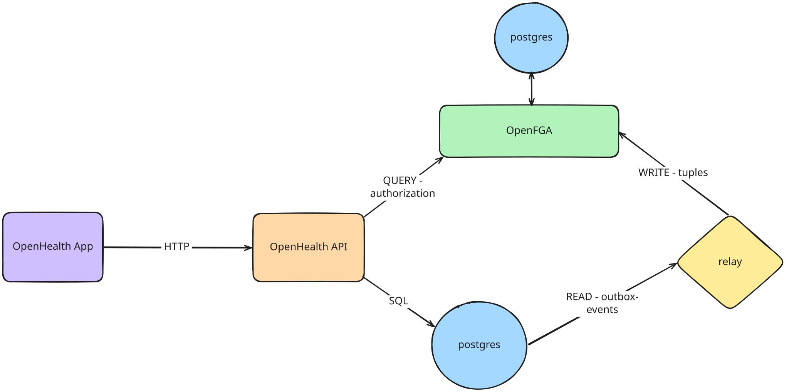

> A hobby project that showcases **authorization models** and **fine-grained access control** using [OpenFGA](https://openfga.dev).

OpenHealth simulates a small healthcare system where patients, doctors, nurses, and hospitals interact around medical records. 

OpenHealth demonstrates how you can model real-world relationships such as a *doctor being assigned to a patient*, or a *nurse working at the hospital a patient visits* and turn those relationships into enforceable permissions with OpenFGA.

The main question we answer with this project is:

> Can this user VIEW or EDIT this medical record?

---

#### Relationships

The relationships defied in OpenHealth are as follows:

- A **patient** owns their **medical records** - this means they can **VIEW** but **CANNOT EDIT** their records.
- A **doctor** assigned to that **patient** can **VIEW** and **EDIT** the **patient's** records.
- A **nurse** at the **patient's hospital** can **VIEW** the **patient's** records, but **CANNOT EDIT** them.

---

## OpenFGA

**OpenFGA** is the authorization engine that powers **OpenHealth**. 

It is a **relationship-based access control (ReBAC)** system built on **Google's [Zanzibar](https://research.google/pubs/pub48190/) project.**

For more information, check out the [OpenFGA documentation](https://openfga.dev/docs).

---

## Architecture

Below is a high-level overview of the architecture of **OpenHealth**.

We use a **relay** on top of the **outbox pattern** to write tuples to the **OpenFGA store** - to ensure that the tuples are persisted and available for querying.



## Authorization model

The authorization model is defined in [`_openfga/openhealth.fga`](./_openfga/openhealth.fga):


## Run Locally

#### Install Dependencies

| Dependency | Description | Link |
| ---------- | ----------- | ---- |
| Docker | Required to run the development stack | [docker.com](https://www.docker.com/) |
| Hurl | Used to seed the database | [hurl.dev](https://hurl.dev/) |

#### Clone The Repo

```bash
git clone https://github.com/<your-org>/openhealth.git
cd openhealth
```

#### Spin Up The Development Stack

```bash
make dev
```

This command runs the following:

1. Starts an **OpenFGA** container and creates a **store** & **authorization model.**
2. Starts the **OpenHealth API Postgres** database and runs the **migrations**.
3. Builds and runs the **OpenHealth API** at [http://localhost:8000](http://localhost:8000).
4. Starts the **OpenHealth App** at [http://localhost:3000](http://localhost:3000).

<br>

> **NOTE -** When creating the OpenFGA store & model the necessary environment variables are generated and stored in a local .env file.

#### Seed The Database

After the **development stack** is up and running, you can **seed** the database with mock data using the following command:

```bash
make seed-db
```

This uses [hurl](https://hurl.dev) to send the requests in [`_hurl/seed.hurl`](./_hurl/seed.hurl).
